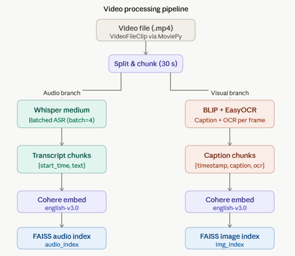
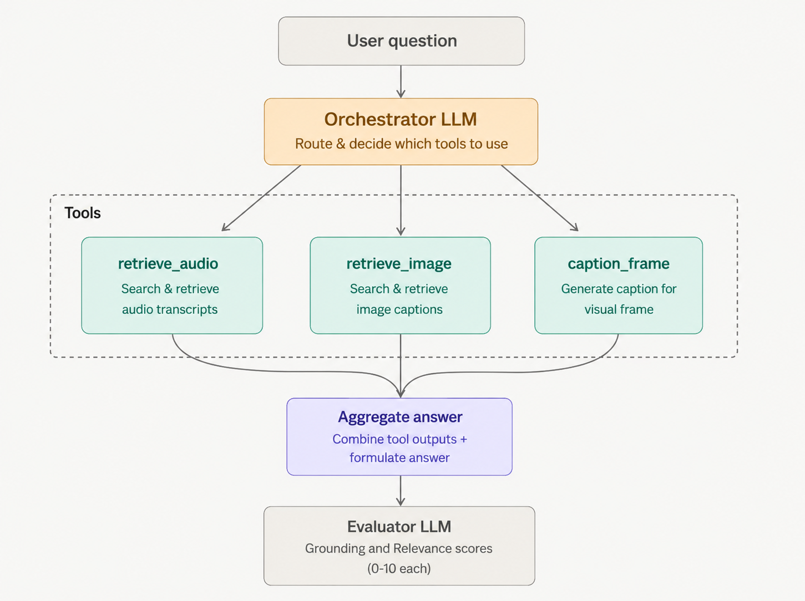
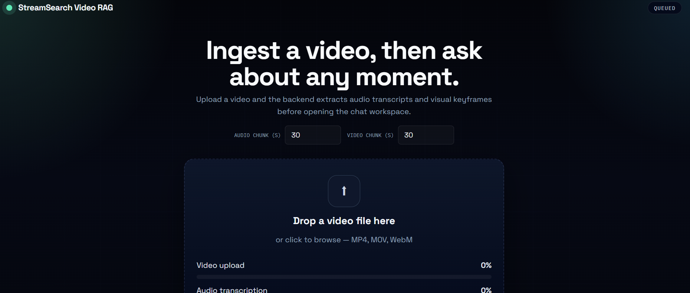
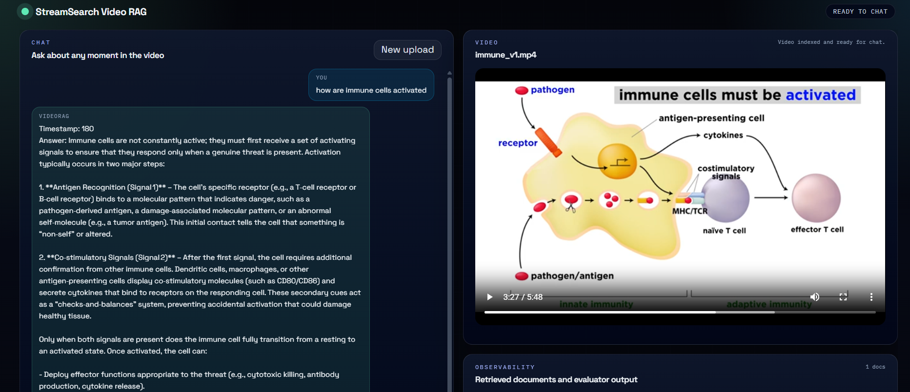

# 📽️ StreamSearch: Agentic Video RAG

StreamSearch is an Agentic Retrieval-Augmented Generation (RAG) system built to answer questions about a video while pointing users to the exact timestamp where the relevant content is located.

## Setup

- Requires GPU support (16 GB VRAM recommended).
- Install React and Python 3.11.
- Create a virtual environment and install dependencies:

```bash
pip install -r requirements.txt
```

- Add a `.env` [check here for info](./backend/README.md) file in the backend directory with your API keys.

## To run

- Frontend:

```bash
cd frontend/vdorag
npm install
npm run dev
```

- Backend:

```bash
cd backend
uvicorn app:app --reload --host 127.0.0.1 --port 8000
```

## Architecture: Video Processing

- Video is transcribed in 30s chunks and stored with timestamps using OpenAI Whisper for time-aligned retrieval, so each chunk can be directly mapped back to an exact moment in the video and retrieved as a tight time window.
- Frames are sampled every 30s, then captioned using BLIP and OCR to extract visual context and on-screen text, enabling image-aware search when the answer is visual rather than spoken and capturing text that never appears in audio.
- Audio text and visual text are normalized into a shared schema so downstream search can treat them consistently, and each item carries provenance metadata like source type, timestamp, and chunk/frame IDs for reliable traceability.
- All text is embedded with Cohere and indexed in a FAISS vector store for fast semantic retrieval, keeping queries responsive even on longer videos while supporting multi-modal evidence in the same index.
- Transcript artifacts are cached for reuse to avoid reprocessing on subsequent runs, reducing latency and cost for repeated queries on the same video and enabling faster iteration on prompts.




## Agentic Workflow

Tools available to the LLM:

1. Retrieve audio transcript chunks by semantic search to locate spoken evidence tied to timestamps and identify the most relevant time spans.
2. Retrieve image caption and OCR results by semantic search to find visual evidence and on-screen text cues that may not exist in the transcript.
3. Caption a specific frame window for detailed visual grounding when the initial evidence is too coarse or ambiguous.

The orchestrator selects tools based on the question, collates tool outputs, and drafts an answer with timestamp references.
An evaluator checks grounding and relevance before returning a final response, while observability captures tool usage, retrieved evidence, model decisions, and evaluation signals to support debugging, regression testing, and quality tracking.




## Features

- Chat interface for Q&A over videos with responses that cite timestamps for quick verification and trust.
- Integrated video player for timestamped references and quick jumps to the cited moment for fast validation.
- Observability through tool usage, retrieved evidence, and evaluator outputs to trace why an answer was produced and where it can be improved.
- Cached transcripts for faster repeat queries and reduced reprocessing cost across multiple sessions.

\

\
\
